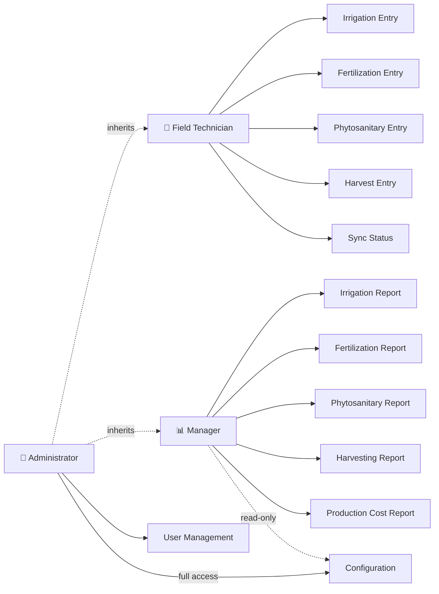
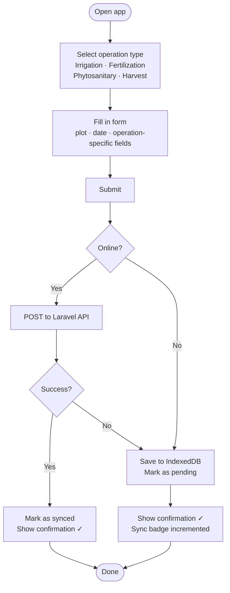
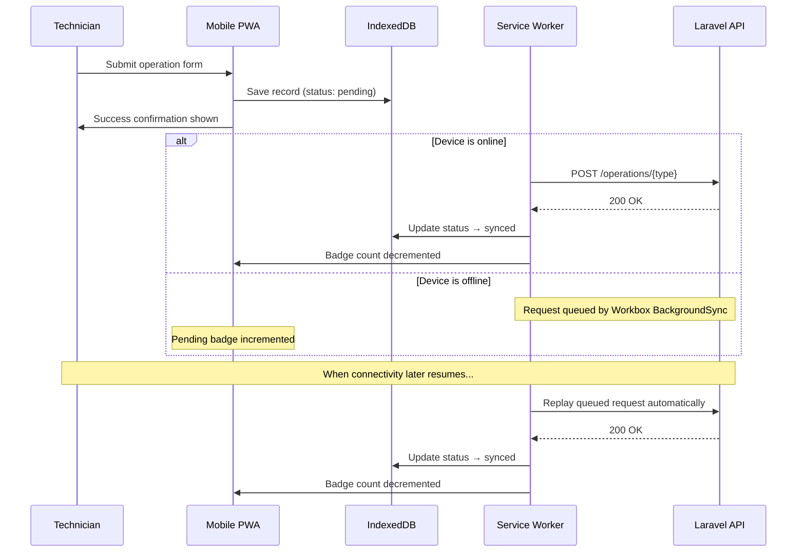

# Agri-Sync — Features Specification

## Overview

Agri-Sync is organised into four functional areas:

1. **Data Entry** — used by the Field Technician via the mobile PWA
2. **Reporting & Analytics** — used by the Manager via the web dashboard
3. **Configuration & Settings** — used by the Administrator via the web dashboard
4. **User Management** — accessible only to the Administrator

---

## 1. Data Entry (Field Technician — Mobile PWA)

The technician records farming operations per plot. All four operation types follow the same workflow: fill in the form, submit, and the record is saved — immediately if online, or queued for sync if offline.

### 1.1 Irrigation

Records water applied to a plot on a given date.

| Field | Type | Notes |
|-------|------|-------|
| Plot | Select | Chosen from the configured plot list |
| Date | Date picker | Date of the irrigation event |
| Water quantity | Number | In the configured measurement unit (e.g. m³, litres) |

### 1.2 Fertilization

Records a fertilizer application, including which product was used.

| Field | Type | Notes |
|-------|------|-------|
| Plot | Select | Chosen from the configured plot list |
| Date | Date picker | Date of the fertilization event |
| Fertilizer | Select | Chosen from the configured fertilizer list |
| Quantity applied | Number | In the unit defined for that fertilizer |

> The system automatically derives NPK values from the quantity and the fertilizer's configured N/P/K percentages. No manual calculation is required from the technician.

### 1.3 Phytosanitary Treatments (Pesticides)

Records a pesticide application, including the target pest and any observations.

| Field | Type | Notes |
|-------|------|-------|
| Plot | Select | Chosen from the configured plot list |
| Date | Date picker | Date of the treatment |
| Pesticide | Select | Chosen from the configured pesticide list |
| Quantity applied | Number | In the unit defined for that pesticide |
| Target pest / parasite | Text | Free-text description of the pest being treated |
| Remarks | Text (optional) | Any observations or notes about the treatment |

### 1.4 Harvesting

Records a harvest event, capturing labour and yield.

| Field | Type | Notes |
|-------|------|-------|
| Plot | Select | Chosen from the configured plot list |
| Date | Date picker | Date of the harvest |
| Number of workers | Number | Headcount of workers on that day |
| Days worked | Number | Duration of the harvest operation (used for cost calculation) |
| Quantity harvested | Number | Yield in the appropriate unit |

---

## 2. Offline Behaviour (Mobile PWA)

The mobile app is designed for field use where connectivity may be unreliable.

- **Offline write:** When the technician submits a form without internet, the record is saved locally on the device (IndexedDB) and marked as pending. The technician sees a success confirmation immediately — there is no blocked waiting state.
- **Background sync:** When connectivity is restored, pending records are automatically sent to the server in the background without any action required from the technician.
- **Offline read:** Previously fetched data (plot list, fertilizer list, pesticide list, recent entries) remains accessible from the local cache when offline.
- **Sync status:** A badge in the app header shows the count of unsynced records. A dedicated sync screen lists all pending and errored items, with a manual "Sync now" option and per-item retry.

---

## 3. Reporting & Analytics (Manager & Administrator — Web Dashboard)

The manager accesses five report pages, each covering a specific operation type. The administrator inherits full access to all reports (as well as all data entry capabilities from the Technician role). All reports are filterable by plot and date range.

### 3.1 Irrigation Report

Provides a view of water usage per plot over time.

- **Bar chart:** Water quantity per hectare, grouped by month
- **Bar chart:** Cumulative water applied since the plot's season start date
- **Table:** Total water quantity per plot up to the current date

*Filters: plot selector, date range*

### 3.2 Fertilization Report

Provides a breakdown of nutrients applied per plot, auto-calculated from the fertilizer compositions recorded at the time of entry.

- **Table (monthly):** Nitrogen (N), Phosphorus (P), and Potassium (K) units per hectare per month — one column per nutrient, one row per month
- **Table (cumulative):** Total NPK units per hectare since the plot's season start date

> NPK units are derived automatically: `applied quantity × fertilizer N/P/K% ÷ plot surface area (ha)`. The manager sees nutrient load directly, without needing to look up fertilizer compositions manually.

*Filters: plot selector, date range*

### 3.3 Phytosanitary Report

A detailed treatment log per plot, designed for traceability and compliance.

- **Table per plot:** Treatment date, pesticide name, chemical composition, target pest, remarks
- **Per-column keyword filter:** Each column header has a search input that filters the table rows in real time

*Filters: plot selector, per-column keyword search*

### 3.4 Harvesting Report

A yield log per plot.

- **Table per plot:** Date, number of workers, days worked, quantity harvested

*Filters: plot selector, date range*

### 3.5 Production Cost Report

A financial summary per plot that aggregates all operation costs for a given period.

| Cost line | Calculation |
|-----------|-------------|
| Irrigation cost | Σ (water quantity × water unit price) |
| Fertilization cost | Σ (quantity applied × fertilizer price per unit) |
| Phytosanitary cost | Σ (quantity applied × pesticide price per unit) |
| Harvest cost | Σ (worker count × days worked × daily labor rate) |
| **Total production cost** | Sum of all above |

The report presents one row per plot, with a breakdown of each cost category and the grand total.

*Filters: plot selector, date range*

---

## 4. Configuration & Settings (Administrator — Web Dashboard)

The administrator configures the reference data that all other features depend on. This module must be set up before any data entry can begin. The manager has **read-only** access to all configuration data for reference when interpreting reports.

### 4.1 Plot Management

Defines the farm's plots. Each plot is the core unit of all operations and reports.

| Field | Notes |
|-------|-------|
| Plot name | Identifier used throughout the app |
| Surface area (ha) | Used for per-hectare calculations in reports |
| Crop type | The category of crop grown (e.g. cereal, fruit tree, vegetable) |
| Variety | The specific variety of the crop |
| Season start date | The date from which cumulative totals are calculated for this plot |

### 4.2 Fertilizers

Defines the fertilizer products available for selection during data entry.

| Field | Notes |
|-------|-------|
| Name | Product name as it appears in the selection list |
| Unit | Measurement unit (e.g. kg, L) |
| Nitrogen (N%) | Percentage of nitrogen in the product |
| Phosphorus (P%) | Percentage of phosphorus in the product |
| Potassium (K%) | Percentage of potassium in the product |
| Price per unit | Used in the production cost report |

### 4.3 Pesticides

Defines the pesticide products available for selection during data entry.

| Field | Notes |
|-------|-------|
| Name | Product name |
| Unit | Measurement unit |
| Chemical composition | Active ingredient(s) and formulation description |
| Price per unit | Used in the production cost report |

### 4.4 Irrigation Water Configuration

Sets the global water measurement and pricing parameters.

| Field | Notes |
|-------|-------|
| Measurement unit | e.g. m³, litres, mm |
| Price per unit | Used in the production cost report |

### 4.5 Labor Rate Configuration

Sets the daily labor rate used to calculate harvesting costs.

| Field | Notes |
|-------|-------|
| Daily labor rate | Cost per worker per day |

---

## 5. User Management (Administrator — Web Dashboard)

The administrator creates and manages all user accounts. There is no self-registration.

| Capability | Notes |
|------------|-------|
| Create user | Set name, email, password, and role |
| Edit user | Update name, role, or reset password |
| Deactivate user | Suspend access without deleting the account |
| Role assignment | Roles: `technician`, `manager`, `admin` |

---

## 6. Internationalisation

Both the mobile app and the admin dashboard support **French (FR)** and **English (EN)**.

- Users can switch languages at any time from the settings (mobile) or the header menu (admin dashboard)
- Language preference is persisted between sessions
- All labels, form fields, error messages, chart axes, and table headers are translated
- Date and number formats adapt to the selected locale (e.g. `DD/MM/YYYY` and decimal commas for French)
