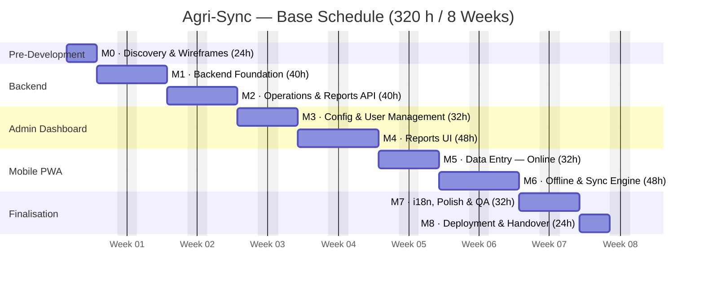
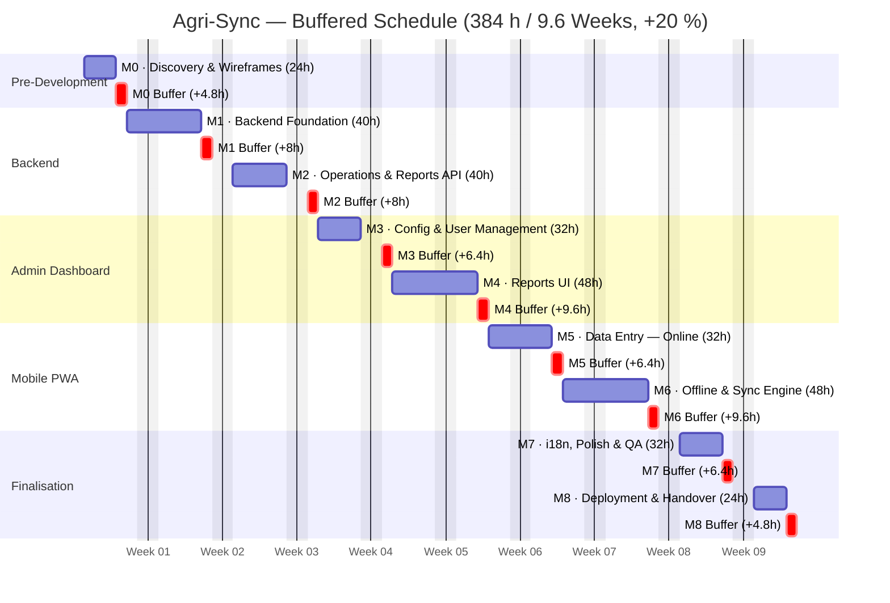

# Agri-Sync — Development Task Plan

## Context

Agri-Sync is a private farm management system for three user roles:
- **Field Technician** (mobile PWA): records farming operations in the field — requires full offline-first capability (read + write offline, sync on reconnect).
- **Manager** (web admin): consults analytics reports, charts, and cost breakdowns per plot; views configuration in read-only mode.
- **Administrator** (web admin): inherits all Technician and Manager permissions; additionally manages user accounts, roles, and system configuration.

**Tech stack:** Laravel + PostgreSQL (API) · Mobile: Ionic/React as a Progressive Web App (PWA) · Admin: Refine Core/React  
**Team:** 1 solo developer  
**Development sequence:** Backend → Admin Dashboard → Mobile PWA (strictly sequential)  
**Key constraints:** Full offline-first PWA (IndexedDB + Service Worker sync) · Bilingual UI (FR/EN, user-switchable) · No existing wireframes or brand guidelines  
**Milestone delivery:** Local demo at the end of each milestone  
**Deadline:** No hard deadline — this plan is an estimation for the project owner  
**Budget:** 320 working hours (8 weeks at 40 h/week) — buffered estimate: 384 h (9.6 weeks, +20 %)

---

## Decisions Captured

| Decision | Choice |
|----------|--------|
| Mobile platform | Progressive Web App (PWA) — no app store, works in-browser |
| Offline mechanism | IndexedDB for local storage + Service Worker (Workbox) for background sync |
| Harvest cost formula | Number of workers × number of days × configurable daily labor rate |
| Season definition | Per-plot configurable season start date (stored on each plot record) |
| User management | Administrator panel within the web admin app |

---

## Overall Estimation

| Milestone | Hours | Days | Weeks | Focus |
|-----------|-------|------|-------|-------|
| M0 | 24 h | 3 d | 0.6 | Discovery, System Design & UX/UI Wireframes |
| M1 | 40 h | 5 d | 1.0 | Backend Foundation (Auth, Config, User Mgmt APIs) |
| M2 | 40 h | 5 d | 1.0 | Backend — Operations & Report Endpoints |
| M3 | 32 h | 4 d | 0.8 | Admin Dashboard — Config & User Management UI |
| M4 | 48 h | 6 d | 1.2 | Admin Dashboard — Reports UI |
| M5 | 32 h | 4 d | 0.8 | Mobile PWA — Foundation & Data Entry (Online) |
| M6 | 48 h | 6 d | 1.2 | Mobile PWA — Offline-First & Sync Engine |
| M7 | 32 h | 4 d | 0.8 | Internationalisation, Polish & QA |
| M8 | 24 h | 3 d | 0.6 | Deployment, UAT & Handover |

**Total: 320 working hours (8 weeks)** for 1 full-time developer.  
Buffered estimate (+20 %): **384 working hours (9.6 weeks)**.

---

## M0 — 24 h: Discovery, System Design & UX/UI Wireframes
*No code written. All architecture and design decisions locked before development begins.*

### System Design
- [ ] Define the full PostgreSQL database schema:
  - `users` (name, email, password, role: `technician` | `manager` | `admin`)
  - `plots` (name, surface_area_ha, crop_type, variety, **season_start_date**)
  - `water_config` (unit, price_per_unit)
  - `fertilizers` (name, unit, n_percent, p_percent, k_percent, price_per_unit)
  - `pesticides` (name, unit, chemical_composition, price_per_unit)
  - `labor_config` (daily_rate) — for harvest cost calculation
  - `irrigation_operations` (date, plot_id, water_quantity)
  - `fertilization_operations` (date, plot_id, fertilizer_id, quantity)
  - `phytosanitary_operations` (date, plot_id, pesticide_id, quantity, target_pest, remarks)
  - `harvest_operations` (date, plot_id, worker_count, days_worked, quantity_harvested)
- [ ] Design complete REST API contract (all endpoints, request/response shapes, error formats)
- [ ] Define offline sync strategy for PWA:
  - **IndexedDB** as the local data store (all operations written there first)
  - **Workbox** (Service Worker library) handles background sync — queues failed POSTs and replays them when online
  - Conflict resolution: last-write-wins by `updated_at` timestamp
  - Initial data cache (plots, fertilizers, pesticides configs) synced on login
- [ ] Choose charting library for admin (e.g., Recharts)
- [ ] Define authentication: Laravel Sanctum (token-based, stateless — works for both SPA and PWA)

### UX / UI Design
- [ ] Create wireframes for all **admin dashboard screens**:
  - Login
  - User management (list, create, edit, deactivate — admin only)
  - Configuration: Plots (CRUD + season start date field)
  - Configuration: Fertilizers (CRUD with NPK % fields)
  - Configuration: Pesticides (CRUD with chemical composition)
  - Configuration: Water config (unit + price)
  - Configuration: Labor daily rate
  - Report: Irrigation (histogram by month + table)
  - Report: Fertilization (NPK tables by month)
  - Report: Phytosanitary (filterable table per plot)
  - Report: Harvesting (table per plot)
  - Report: Production Cost (cost breakdown per plot)
  - Language toggle (FR/EN) in header
- [ ] Create wireframes for all **mobile PWA screens**:
  - Login
  - Home / operation type selector
  - Irrigation entry form
  - Fertilization entry form
  - Phytosanitary treatment entry form
  - Harvest entry form
  - Sync status screen (pending items count, manual sync button, error list)
  - Settings (language switch FR/EN)
- [ ] Define a minimal design system: color palette, typography, spacing, component style (applies to both apps)
- [ ] Review wireframes with project owner before development begins

**Deliverables:** Entity-Relationship Diagram, API contract document, offline sync architecture diagram, wireframes for all screens, design system document.

---

## M1 — 40 h: Backend Foundation

### Laravel + PostgreSQL Setup
- [ ] Initialize Laravel project (`/api`), configure PostgreSQL connection
- [ ] Set up Laravel Sanctum for API token authentication
- [ ] Write all database migrations from schema designed in M0
- [ ] Write database seeders for development (sample plots, fertilizers, pesticides, test users)

### Authentication & User Management API
- [ ] `POST /auth/login` — returns Sanctum token
- [ ] `POST /auth/logout` — revoke token
- [ ] `GET /auth/me` — return current user profile
- [ ] `GET/POST /users` — list users, create user (admin role only)
- [ ] `GET/PUT/DELETE /users/{id}` — view, update, deactivate user (admin only)
- [ ] Role middleware: `admin` (inherits all `technician` + `manager` permissions), `manager`, `technician` — protect all relevant routes

### Configuration APIs
- [ ] `GET/POST/PUT/DELETE /plots` — CRUD; include `season_start_date` field
- [ ] `GET/POST/PUT/DELETE /fertilizers` — CRUD; include N/P/K percentage fields
- [ ] `GET/POST/PUT/DELETE /pesticides` — CRUD; include chemical composition
- [ ] `GET/PUT /water-config` — read and update water unit + price
- [ ] `GET/PUT /labor-config` — read and update daily labor rate (for harvest cost)
- [ ] Server-side input validation on all endpoints; structured error responses

### Project Setup (Admin + Mobile)
- [ ] Initialize Refine Core React project (`/admin`), configure data provider + Sanctum auth provider
- [ ] Initialize Ionic/React PWA project (`/mobile`), configure Service Worker (Workbox via Vite PWA plugin)
- [ ] Set up i18n foundation in both projects (react-i18next, placeholder FR + EN locale files)
- [ ] Set up base layout in admin (sidebar, header with language toggle)

---

## M2 — 40 h: Backend — Operations & Report Endpoints

### Operation APIs (technician role)
- [ ] `POST /operations/irrigation` — date, plot_id, water_quantity
- [ ] `GET /operations/irrigation` — list with filters (plot_id, date range)
- [ ] `POST /operations/fertilization` — date, plot_id, fertilizer_id, quantity
- [ ] `GET /operations/fertilization` — list with filters
- [ ] `POST /operations/phytosanitary` — date, plot_id, pesticide_id, quantity, target_pest, remarks
- [ ] `GET /operations/phytosanitary` — list with filters; support keyword search param
- [ ] `POST /operations/harvest` — date, plot_id, worker_count, days_worked, quantity_harvested
- [ ] `GET /operations/harvest` — list with filters

### Report Endpoints (manager and admin roles)
All report endpoints accept `?plot_id=` and `?from=` / `?to=` date range filters.

- [ ] `GET /reports/irrigation`
  - Monthly water quantity per hectare (qty / plot surface area), grouped by month
  - Cumulative water since `season_start_date` of each plot
  - Total water per plot to current date
- [ ] `GET /reports/fertilization`
  - Monthly N, P, K units per hectare (calculated: quantity × fertilizer N/P/K% / surface area)
  - Cumulative NPK totals since `season_start_date`
- [ ] `GET /reports/phytosanitary`
  - Per plot: date, pesticide name, chemical composition, target pest, remarks
  - Keyword filter query param applied across all text fields
- [ ] `GET /reports/harvest`
  - Per plot: date, worker count, days worked, quantity harvested
- [ ] `GET /reports/costs`
  - Per plot:
    - Irrigation cost = Σ (water_quantity × water unit price)
    - Fertilization cost = Σ (quantity × fertilizer price)
    - Phytosanitary cost = Σ (quantity × pesticide price)
    - Harvest cost = Σ (worker_count × days_worked × labor daily rate)
    - Total cost = sum of above
- [ ] Write automated tests for NPK calculation logic and cost calculation logic (unit tests)

**Demo checkpoint:** All API endpoints return correct data — verify with Postman or Bruno against seeded database.

---

## M3 — 32 h: Admin Dashboard — Configuration & User Management

### User Management (admin role)
- [ ] Users list page with role badges and active/inactive status
- [ ] Create user form (name, email, password, role selector)
- [ ] Edit user form (name, role, deactivate toggle)

### Configuration Module
- [ ] Plots management page (list, create, edit, delete — include season start date picker)
- [ ] Fertilizers management page (list, create, edit, delete — include N/P/K % fields)
- [ ] Pesticides management page (list, create, edit, delete — include chemical composition)
- [ ] Water configuration page (edit unit label and price per unit)
- [ ] Labor configuration page (edit daily labor rate)
- [ ] Grant manager role read-only access to all configuration pages (view lists only, no create/edit/delete)
- [ ] All pages bilingual (FR/EN) using i18n keys
- [ ] Form validation with clear error messages

**Demo checkpoint:** Admin can log in, create plots with season dates, configure all input types, manage users.

---

## M4 — 48 h: Admin Dashboard — Reports UI

### Report Pages
- [ ] **Irrigation report:**
  - Bar chart: water quantity per hectare per month
  - Bar chart: cumulative water since plot season start
  - Table: total water per plot to current date
  - Plot selector and date range filter controls
- [ ] **Fertilization report:**
  - Table: N, P, K units per hectare per month (one column per nutrient)
  - Cumulative NPK totals table
  - Plot and date range filter controls
- [ ] **Phytosanitary report:**
  - Filterable table per plot: date, pesticide, chemical composition, target pest, remarks
  - Per-column keyword search input
  - Plot selector
- [ ] **Harvesting report:**
  - Table per plot: date, workers, days, quantity harvested
  - Plot and date range filter
- [ ] **Production cost report:**
  - Summary table per plot: irrigation cost, fertilization cost, phytosanitary cost, harvest cost, total
  - Plot and date range filter
- [ ] Print-friendly CSS for all report pages (manager can print/save as PDF from browser)
- [ ] All report pages bilingual (FR/EN)

**Demo checkpoint:** Manager can view all 5 reports, apply filters, and see correctly calculated values.

---

## M5 — 32 h: Mobile PWA — Foundation & Data Entry (Online)

### PWA Foundation
- [ ] Configure Vite PWA plugin with Workbox for service worker generation
- [ ] Set up offline-capable app shell (cached via service worker on first load)
- [ ] Implement login screen, token storage in localStorage
- [ ] Set up i18n (FR/EN, language switcher in settings screen)
- [ ] Set up React Router with protected routes (redirect to login if no token)
- [ ] Fetch and cache reference data on login (plots, fertilizers, pesticides) in IndexedDB

### Data Entry Forms (online flow)
- [ ] Home screen: large tap-target buttons for each operation type
- [ ] Irrigation entry form: plot selector, date picker, water quantity input → POST to API
- [ ] Fertilization entry form: plot selector, date picker, fertilizer selector (from cached list), quantity → POST
- [ ] Phytosanitary form: plot, date, pesticide selector (cached), quantity, target pest, remarks → POST
- [ ] Harvest form: plot, date, worker count, days worked, quantity → POST
- [ ] Show success confirmation after each submission
- [ ] Show recent entries list per operation type (pulled from API)

**Demo checkpoint:** Technician can log in and submit all 4 operation types from the mobile PWA while online.

---

## M6 — 48 h: Mobile PWA — Offline-First & Sync Engine

### Offline Write
- [ ] On form submit: write to IndexedDB immediately (with `sync_status: "pending"`) and show success — user gets instant feedback regardless of connectivity
- [ ] When online at submit time: also fire the API call; mark as `synced` on success
- [ ] If API call fails (offline or error): entry stays `pending` in IndexedDB

### Background Sync
- [ ] Register a Workbox `BackgroundSyncPlugin` on all POST operation requests — replays queued requests automatically when connectivity is restored
- [ ] Fallback manual sync: "Sync now" button that iterates all `pending` IndexedDB entries and POSTs them
- [ ] On app resume / network-online event: trigger sync pass
- [ ] Sync status indicator in header: badge showing count of unsynced items
- [ ] Sync status screen: list of pending items with status (pending / syncing / error), manual retry for errored items

### Offline Read
- [ ] All lists (plots, fertilizer names, pesticide names, recent operations) are served from IndexedDB when offline
- [ ] Pull-to-refresh when online to update cached reference data and operation history

**Demo checkpoint:** Submit operations with network throttled to offline in browser DevTools — items queue locally. Restore network — items sync automatically and badge clears.

---

## M7 — 32 h: Internationalisation, Polish & QA

### Internationalisation (both apps)
- [ ] Complete all FR translation strings (admin + mobile — every label, placeholder, error message, chart axis label)
- [ ] Complete all EN translation strings
- [ ] Language preference persists in localStorage across sessions
- [ ] Date formats per locale (DD/MM/YYYY for FR, MM/DD/YYYY for EN)
- [ ] Number formatting per locale (decimal comma for FR, decimal point for EN)

### UI Polish
- [ ] Apply consistent design system (colors, typography, spacing) across all screens
- [ ] Implement empty states (no data entered yet), loading skeletons, and error banners
- [ ] Ensure mobile forms are touch-friendly: large tap targets, correct keyboard types (numeric inputs trigger number keyboard)
- [ ] Admin dashboard: responsive layout for desktop and tablet
- [ ] Ensure all form submissions disable the submit button while in-flight (prevent double-submit)

### QA
- [ ] Test all offline scenarios in browser DevTools:
  - Submit while offline → entry queues
  - Reconnect → entry syncs automatically
  - App reload while offline → cached data visible, forms still work
- [ ] Test NPK calculation accuracy with known values
- [ ] Test production cost calculations with known values
- [ ] Test all report filters (date range, plot, keyword)
- [ ] Test role enforcement: technician cannot access reports; manager cannot create operations
- [ ] Cross-browser testing for admin and mobile PWA (Chrome, Firefox, Edge, Safari on iOS)
- [ ] Security review: token handling, role middleware on all API routes, no raw SQL (Eloquent ORM only), CSRF protection

---

## M8 — 24 h: Deployment, UAT & Handover

### Deployment
- [ ] Configure production PostgreSQL on private server
- [ ] Set up Laravel production environment (`.env.production`, optimize config/route caches)
- [ ] Configure HTTPS (SSL certificate required — PWA service workers only work over HTTPS)
- [ ] Set up Nginx to serve both the admin and mobile PWA static builds, and proxy `/api` to Laravel
- [ ] Build admin React app for production and deploy static files
- [ ] Build mobile PWA for production and deploy static files (installable from browser)
- [ ] Seed production database with real initial data (plots, fertilizer catalogue, pesticide catalogue, admin account)
- [ ] Smoke-test all API endpoints on production

### UAT & Handover
- [ ] User Acceptance Testing session with actual Field Technician: test all data entry forms including offline scenarios
- [ ] UAT session with Manager: test all 5 report pages, filter controls, language switching
- [ ] Fix critical bugs found during UAT
- [ ] Write a concise user guide:
  - Field Technician: how to install PWA, enter operations, check sync status
  - Manager: how to read each report, apply filters, switch language
  - Admin: how to create users, configure plots and inputs
- [ ] Deliver source code repository, deployment documentation, and credentials to project owner

---

## Summary Table

| Milestone | Hours | Primary deliverable |
|-----------|-------|---------------------|
| M0 | 24 h | ERD, API contract, wireframes, design system |
| M1 | 40 h | Running Laravel API with auth + config endpoints; both front-end projects scaffolded |
| M2 | 40 h | All operation + report API endpoints working, unit-tested |
| M3 | 32 h | Admin: configuration module + user management live |
| M4 | 48 h | Admin: all 5 report pages live and filterable |
| M5 | 32 h | Mobile PWA: all data entry forms working online |
| M6 | 48 h | Mobile PWA: full offline-first with background sync |
| M7 | 32 h | Both apps bilingual, polished, QA-passed |
| M8 | 24 h | Deployed on private server, UAT complete, handed over |

**Total: 320 working hours (8 weeks)** for 1 full-time developer.  
Buffered estimate (+20 %): **384 working hours (9.6 weeks)**.
