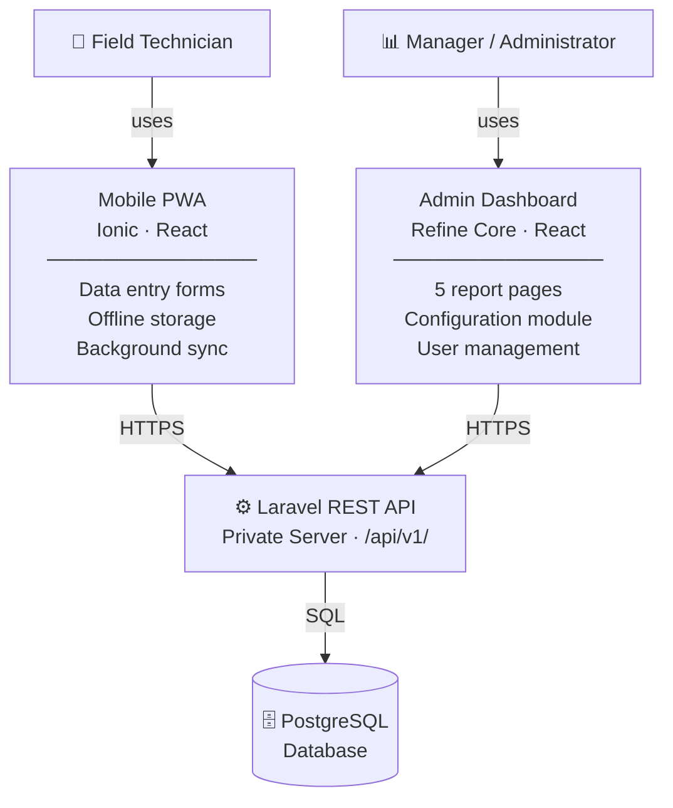

# Agri-Sync — Project Overview

## What Is Agri-Sync?

Agri-Sync is a private, full-stack farm management system designed to digitise and centralise the tracking of field operations across multiple crop plots. It replaces manual record-keeping with structured data entry, automated calculations, and detailed analytics — giving farm managers a clear, real-time view of operations and costs at all times.

The system is self-hosted on the farm's private server, keeping all agricultural data internal and secure.

---

## Purpose

The core purpose of Agri-Sync is to bridge the gap between what happens in the field and what management sees in the office.

Field technicians record operations directly on-site — including irrigation, fertilization, phytosanitary treatments, and harvesting — using a mobile-optimised app that works even without an internet connection. Those records are automatically synchronised to the central server when connectivity is available.

Managers then access a web dashboard where all recorded data is aggregated into structured reports, charts, and cost summaries — enabling informed decisions about resource usage, treatment schedules, and production costs per plot.

---

## Key Characteristics

- **Multi-crop:** The system supports multiple plots with different crop types and varieties, each tracked independently.
- **Offline-first mobile access:** The field technician app functions fully without internet connectivity. Operations entered offline are queued locally and synced to the server automatically when a connection is restored.
- **Automated calculations:** NPK (Nitrogen, Phosphorus, Potassium) nutrient units and production costs are calculated automatically based on configured fertilizer compositions, pesticide prices, water rates, and labor rates — no manual arithmetic required.
- **Bilingual interface:** Both the mobile app and the admin dashboard support French and English. Users can switch languages at any time, and their preference is remembered.
- **Role-based access:** The system enforces a hierarchical role model. Technicians can only enter data. Managers consult reports and view configuration in read-only mode. Administrators inherit all Technician and Manager permissions and additionally manage user accounts and system configuration.

---

## Users

| Role | Interface | Responsibilities |
|------|-----------|-----------------|
| **Field Technician** | Mobile PWA | Records irrigation, fertilization, phytosanitary treatments, and harvesting operations per plot |
| **Manager** | Web dashboard | Consults reports, charts, and cost analytics per plot and per season; views configuration in read-only mode |
| **Administrator** | Web dashboard + Mobile PWA | Inherits all Technician and Manager permissions; additionally manages user accounts, plot definitions, and system configuration (fertilizers, pesticides, pricing) |

---

## Deployment

Agri-Sync is deployed entirely on the farm's **private server**. There is no reliance on third-party cloud services. The mobile app is distributed as a **Progressive Web App (PWA)** — field technicians access it directly from the browser on any device and can install it to their home screen without an app store.

---

## System at a Glance

