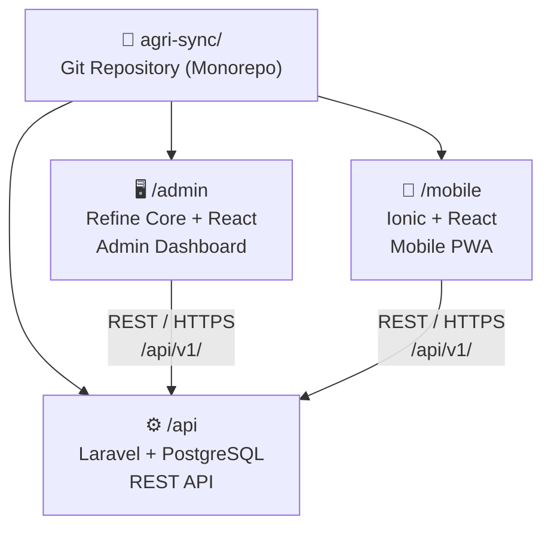
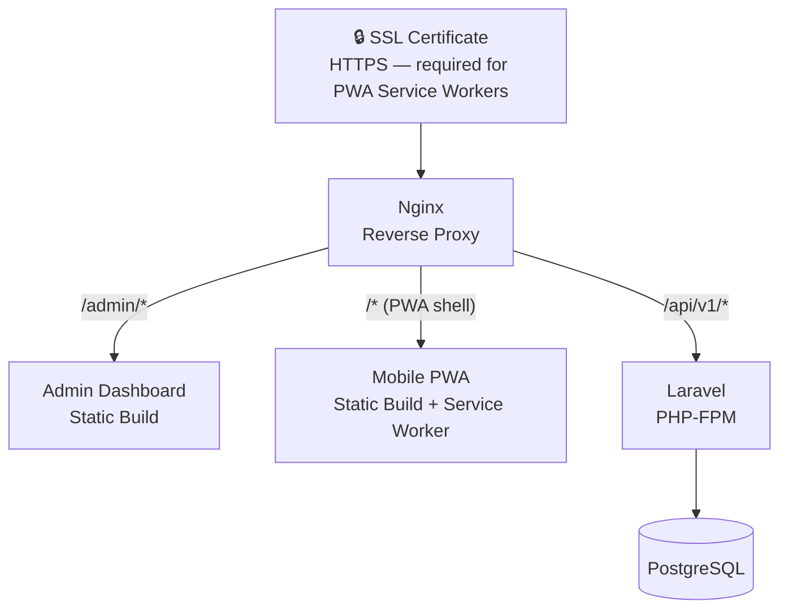

# Agri-Sync — Tech Stack

## Architecture Overview

Agri-Sync is structured as three independent sub-projects living inside a single **monorepo**, all communicating over a versioned REST API:

### Why a monorepo?

All three parts are tightly coupled — a change to a database field or API endpoint affects both frontends simultaneously. With a single repository, the developer can coordinate those changes in one commit, keep the API contract document at the root where all sub-projects can reference it, and avoid the overhead of managing three separate repositories for what is logically one system.

The main alternative — three separate repositories — is better suited to multi-team projects where independent teams need to move at their own pace. For a solo developer on a private system, it adds friction with no real benefit.

### Monorepo structure rules

While the three sub-projects share a repository, each must remain **independently buildable and deployable**. This means:

- `/api` has its own `composer.json` and `.env` — runnable standalone with `php artisan serve`
- `/admin` has its own `package.json` and `.env` — buildable standalone with `npm run build`
- `/mobile` has its own `package.json` and `.env` — buildable standalone with `npm run build`

There is no shared `node_modules` at the root and no root-level build script orchestrating all three. Each sub-project is independently runnable in development and independently deployable to the server.

The root of the repository contains only the [`README.md`](../README.md) and this `docs/` folder.

Each sub-project is developed, built, and deployed independently. The backend exposes a versioned REST API (`/api/v1/`) consumed by both frontends.

---

## Sub-Projects

### 1. Backend — Laravel + PostgreSQL

**Directory:** `/api`

| Layer | Technology |
|-------|-----------|
| Framework | Laravel (PHP) |
| Database | PostgreSQL |
| Authentication | Laravel Sanctum (token-based, stateless) |
| API style | REST, versioned under `/api/v1/` |

**Why Laravel:**
Laravel provides a mature, opinionated structure that accelerates backend development without sacrificing flexibility. Its Eloquent ORM handles all database interactions safely (no raw SQL), its migration system keeps the schema version-controlled, and Laravel Sanctum offers a lightweight, token-based authentication mechanism well-suited to both SPA and PWA clients.

**Why PostgreSQL:**
PostgreSQL is a robust, production-grade relational database well-suited to the structured, relational nature of farm operation data (plots, operations, configurations). It handles date-range queries and aggregations — central to the reporting features — efficiently and reliably.

**Key backend responsibilities:**
- Enforce role-based access control (`admin`, `manager`, `technician`) — the `admin` role inherits all `technician` and `manager` permissions
- Expose CRUD endpoints for all configuration entities (plots, fertilizers, pesticides, water config, labor config)
- Accept operation submissions from the mobile app
- Compute and return aggregated report data (NPK calculations, cost summaries, monthly groupings)
- Validate all incoming data server-side

---

### 2. Admin Dashboard — Refine Core (React)

**Directory:** `/admin`

| Layer | Technology |
|-------|-----------|
| Framework | Refine Core (React) |
| Language | TypeScript / JavaScript |
| Charting | Recharts (or equivalent React charting library) |
| Internationalisation | react-i18next |
| Auth | Refine auth provider with Laravel Sanctum tokens |

**Why Refine Core:**
Refine is a React meta-framework built specifically for data-heavy admin interfaces. It provides a data provider abstraction that maps directly to REST API endpoints, built-in CRUD page patterns, and hooks for filtering, sorting, and pagination — all of which map naturally to the configuration module and report pages in Agri-Sync. This significantly reduces boilerplate compared to a vanilla React setup.

**Key dashboard responsibilities:**
- User account management (admin role only)
- Full configuration module (plots, fertilizers, pesticides, water, labor)
- Five report pages with charts, filterable tables, and date range controls
- Language switcher (FR/EN) persisted across sessions
- Print-friendly layouts for all report pages

---

### 3. Mobile App — Ionic (React) as a PWA

**Directory:** `/mobile`

| Layer | Technology |
|-------|-----------|
| Framework | Ionic (React) |
| Offline storage | IndexedDB (via `idb` or Dexie.js) |
| Service Worker / Sync | Workbox (via Vite PWA Plugin) |
| Internationalisation | react-i18next |
| Auth | Sanctum token stored in localStorage |

**Why Ionic:**
Ionic provides a library of mobile-optimised UI components (touch-friendly inputs, bottom navigation, modals, pull-to-refresh) that work seamlessly inside a PWA. Combined with React, it allows the mobile app to share tooling and patterns with the admin dashboard while delivering a native-feeling experience in the browser.

**Why PWA (not a native app):**
Distributing the technician app as a Progressive Web App avoids the overhead of managing an app store presence (Apple App Store / Google Play). Field technicians can access the app from any device browser, install it to their home screen in one tap, and receive updates automatically without any manual install step. PWAs also support all the required offline capabilities via Service Workers.

**Why IndexedDB + Workbox:**
- **IndexedDB** is the browser's built-in structured storage, capable of holding all operation records, configuration data, and a sync queue persistently on-device — surviving app restarts and browser refreshes.
- **Workbox** is a production-grade Service Worker library maintained by Google. Its `BackgroundSyncPlugin` handles the retry logic for failed API requests automatically: when the device goes offline mid-operation, Workbox queues the request and replays it the moment connectivity returns, without any code needed in the app layer.

**Key mobile responsibilities:**
- Four data entry forms (irrigation, fertilization, phytosanitary, harvesting)
- Immediate local save on submit (no blocked waiting for network)
- Background sync of pending records when connectivity resumes
- Offline read of cached reference data (plots, fertilizers, pesticides)
- Sync status screen with manual retry capability
- Language switcher (FR/EN)

---

## Cross-Cutting Concerns

### Authentication

Laravel Sanctum issues API tokens on login. Tokens are stored:
- In `localStorage` on the mobile PWA
- Via the Refine auth provider on the admin dashboard

All API routes are protected by role middleware. Requests without a valid token return `401 Unauthorized`; requests by a role without permission return `403 Forbidden`.

### Internationalisation (i18n)

Both frontends use **react-i18next** with separate locale files for French (`fr.json`) and English (`en.json`). Language selection is persisted in `localStorage`. Date and number formatting adapts to the active locale.

### Deployment

| Component | Deployment method |
|-----------|------------------|
| Laravel API | PHP-FPM on the private server, proxied by Nginx |
| Admin dashboard | Static build (`npm run build`) served by Nginx |
| Mobile PWA | Static build served by Nginx; HTTPS required for Service Workers |
| Database | PostgreSQL running on the private server |

> **Important:** PWA Service Workers only function over HTTPS. An SSL certificate on the private server is a hard requirement for the mobile offline functionality to work.

---

## Development Tooling

| Tool | Purpose |
|------|---------|
| Git | Version control (one repository, three sub-project directories) |
| Postman / Bruno | API testing during backend development |
| Laravel Telescope *(optional)* | API request debugging in development |
| Vite | Frontend build tool for both React projects |
| ESLint + Prettier | Code style consistency across both frontends |
